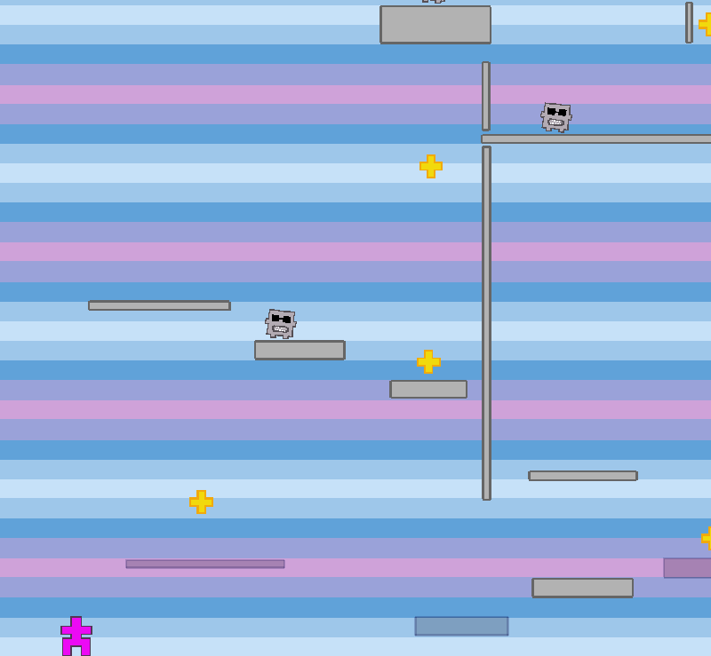

A prototypical 2d platform game
-------------------------------

Make and Install
----------------

    cabal install cabal-dev

    git clone https://github.com/dan-t/Gamgine
    git clone https://github.com/dan-t/layers

    cd layers
    cabal-dev add-source ../Gamgine
    cabal-dev install

    (If the Gamgine directory isn't in the same directoy than the layers one,
     than 'Include-dirs' in 'layers.cabal' has to be modified)

Common flags
------------

    -e --editmode             Start layers in edit mode
    -l --loadlevelsfrom=FILE  Load levels from file
                              (default='~/.cabal/share/layers-0.2/Ressources/Levels.hs')
    -s --savelevelsto=FILE    Save levels to file (default='LayersData.hs')
    -h --help                 Display help message
    -v --version              Print version information

Player Controls
---------------

    left/right arrow key = moving left/right
    space/up arrow key   = jumping
    tab key              = switch layer
    q/escape key         = exit game

Edit Mode
---------

    a key = add new level after the current one and switch to it
    A key = add new level before the current one and switch to it
    n key = goto next level
    N key = goto previous level
    m key = move current level after the next one
    M key = move current level before the previous one
    l key = reload current level
    s key = save levels to file specified by '-s'
    r key = remove game object under mouse cursor
    p key = place a star at mouse cursor position
    e key = place an enemy at mouse cursor position
    u key = start changing path of platform/enemy under mouse cursor,
            define path points by moving the mouse and clicking
            left mouse button, press 'u' again to end path definition
  
    left mouse button + ctrl  = move game object under mouse cursor
                                (hold mouse button pressed)
    left mouse button + shift = resize platform under mouse cursor
                                (hold mouse button pressed)
    left mouse button         = define new platform by holding the
                                button pressed and moving the mouse
    mouse wheel               = change scale of orthographic projection
